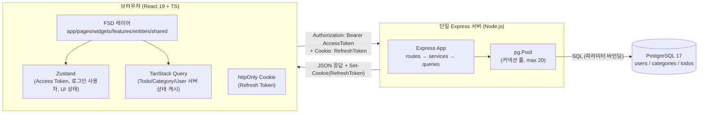
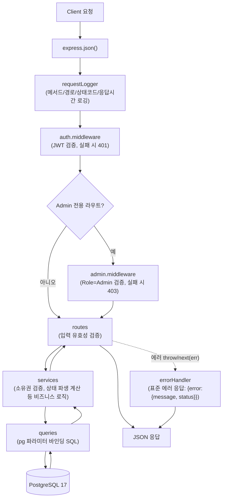
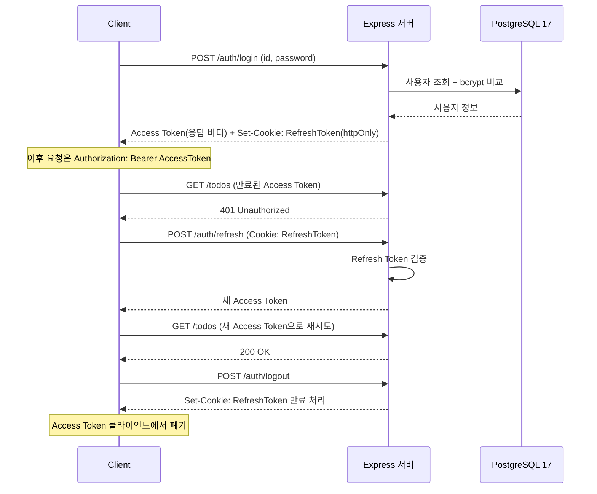

# my-ToDoList 아키텍처 다이어그램

## 버전 이력
| 버전 | 요약 내용 | 근거/출처 | 날짜 |
|---|---|---|---|
| 1.0 | 최초 작성: 전체 시스템 아키텍처, 요청 처리 흐름 다이어그램 | 2-prd.md, 5-project-principle.md | 2026-08-26 |
| 1.1 | 인증 요청 시퀀스 다이어그램 추가(로그인, Access Token 만료 시 재발급, 로그아웃) | 3-user-scenario.md 시나리오2·3·4 | 2026-08-26 |
| 1.2 | 다이어그램 내 DB 라벨을 "PostgreSQL"에서 "PostgreSQL 17"로 통일 | 기술스택 일관성 검토 결과 | 2026-08-26 |

## 문서 개요
1인 개발/2일 일정, 단일 Express 서버 + 단일 PostgreSQL 인스턴스(마이크로서비스 없음) 제약을 그대로 반영한 최소 구조의 아키텍처 다이어그램이다. 상세 레이어/네이밍은 `5-project-principle.md`를 따른다.

## 1. 전체 시스템 아키텍처
클라이언트-서버-DB 흐름과 JWT Access/Refresh Token의 저장 위치를 표시한다. Access Token은 클라이언트 메모리(Zustand)에, Refresh Token은 httpOnly 쿠키에 보관한다.

## 2. 요청 처리 흐름 (미들웨어 포함)
인증이 필요한 API 요청 하나가 라우트→서비스→쿼리→DB를 거쳐 응답하는 흐름이다.

## 3. 인증 요청 시퀀스 (로그인 → 재발급 → 로그아웃)
로그인 성공 시 토큰 발급, Access Token 만료 시 자동 재발급, 로그아웃 시 폐기 흐름이다(3-user-scenario.md 시나리오 2·3·4).

