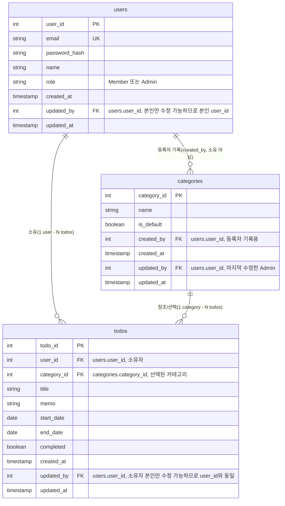

# my-ToDoList ERD

## 버전 이력
| 버전 | 요약 내용 | 근거/출처 | 날짜 |
|---|---|---|---|
| 1.0 | 최초 작성: users/categories/todos 3개 테이블 ERD(mermaid erDiagram), 테이블별 핵심 제약사항 정리 | 1-domain-definition.md 3-4장, 5-project-principle.md 3장, 6-arch.md | 2026-08-26 |
| 1.1 | 각 테이블 PK를 공통 `id`에서 목적이 드러나는 이름으로 변경(`user_id`/`category_id`/`todo_id`), FK 참조명을 PK명과 일치시킴 | 사용자 요청 | 2026-08-26 |
| 1.2 | 3개 테이블 모두에 수정자(`updated_by`)/수정시간(`updated_at`) 컬럼 추가(기존엔 생성자/생성시간만 있었음) | 사용자 요청 | 2026-08-26 |

## 1. ERD

- `users --o{ categories`는 소유 관계가 아니라 `created_by`/`updated_by`(→`users.user_id`) 컬럼이 등록·수정한 Admin을 기록만 하는 관계다(1-domain-definition.md 4장: Category는 Admin 그룹이 공동 관리하는 전역 목록).
- `users --o{ todos`, `categories --o{ todos`는 각각 소유(FK `user_id`)와 참조/선택(FK `category_id`) 관계다. `todos.updated_by`는 소유자 본인만 수정 가능하므로(도메인 6장 규칙2) 항상 `user_id`와 같은 값이다.
- `users.updated_by`도 같은 이유로 본인만 수정 가능하여 항상 자기 자신의 `user_id`를 가리킨다.

## 2. 테이블별 핵심 제약사항

### users
- `email`: UNIQUE, 로그인 식별자(중복 가입 거부).
- `password_hash`: bcrypt 해시만 저장, 평문 저장/로그 기록 금지.
- `role`: `Member` | `Admin`.
- `updated_by`/`updated_at`: 본인 정보만 수정 가능하므로(도메인 6장 규칙2) `updated_by`는 항상 본인 `user_id`. 최초 생성 시에는 `created_at`과 동일한 값으로 채운다.

### categories
- `is_default = true`인 행은 전역 1개만 존재해야 한다(도메인 6장 규칙5).
- 등록·수정·삭제는 Admin만 가능(애플리케이션 레벨 권한 검증, DB 제약 아님).
- `created_by`는 등록자 기록용 FK일 뿐 소유권을 의미하지 않는다. `updated_by`는 마지막으로 수정한 Admin의 `user_id`(도메인 6장 규칙3 — Admin만 수정 가능).
- 카테고리 삭제 시 이를 참조하던 `todos`는 기본(`is_default = true`) 카테고리로 재할당한다(도메인 8장 예외케이스) — 서비스 계층 트랜잭션으로 처리, DB의 `ON DELETE`는 이 재할당 로직을 대체하지 않는다. 이때 재할당된 `todos.updated_by`는 재할당을 트리거한 Admin이 아니라 원래 소유자(`user_id`)로 유지한다(소유자만 수정 가능 규칙과의 일관성).

### todos
- `user_id`, `category_id`: NOT NULL FK. `category_id` 미지정 시 서비스 계층에서 기본 카테고리로 자동 지정(도메인 6장 규칙4).
- `start_date <= end_date` 검증(도메인 6장 규칙6, DB 제약 또는 애플리케이션 검증).
- `completed`: 상태(시작전/진행중/완료/지연)는 별도 컬럼으로 저장하지 않고 `completed` + `start_date`/`end_date`를 오늘 날짜와 비교해 조회 시 파생 계산한다(도메인 5장, 5-project-principle.md 1장).
- 한 사용자가 같은 기간에 여러 Todo 등록 가능(1일 1건 제약 없음, 도메인 6장 규칙7).
- `updated_by`: 소유자 본인만 수정 가능하므로(도메인 6장 규칙2) 항상 `user_id`와 동일한 값. 완료 토글도 수정으로 간주해 `updated_at`을 갱신한다.
- 인덱스: `user_id`, `category_id`(6-arch.md/5-project-principle.md 5장).
